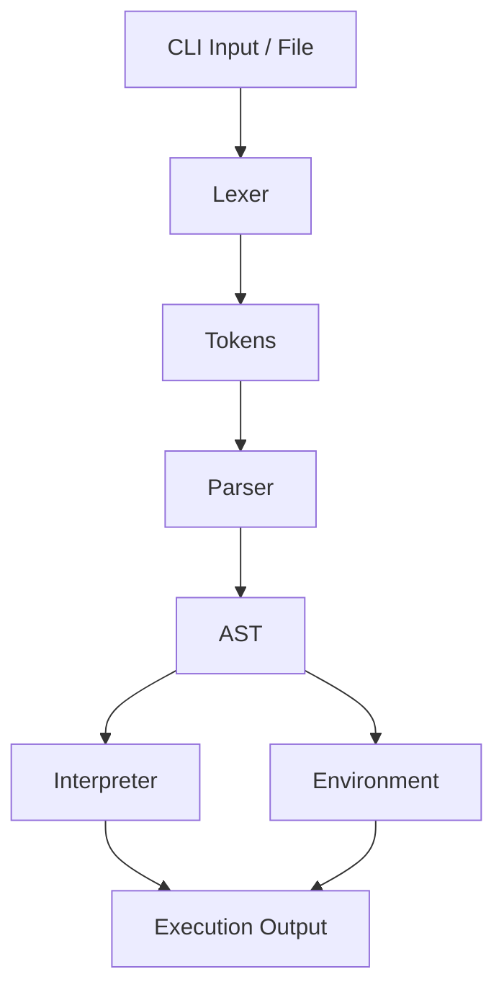

# Kin Programming Language – Architecture & Contributor Guide

## Overview

Kin is a programming language that allows users to write computer programs in Kinyarwanda. This document explains the architecture, data flow, and main components of the Kin project, making it easier for new contributors to understand, extend, and debug the system.

---

## Table of Contents

1. [High-Level Architecture](#1-high-level-architecture)
2. [Directory Structure](#2-directory-structure)
3. [Execution Flow (from CLI to Evaluation)](#3-execution-flow)
4. [Core Components](#4-core-components)
    - Lexer
    - Parser
    - Interpreter
    - Environment
    - Evaluation (Statements & Expressions)
5. [Adding Features & Contributing](#5-adding-features--contributing)
6. [Additional Resources](#6-additional-resources)

---

## 1. High-Level Architecture

Kin is implemented as a **tree-walk interpreter**. This means that after parsing, the interpreter directly walks the Abstract Syntax Tree (AST) and evaluates each node recursively, rather than compiling to bytecode or another intermediate representation. This approach makes the codebase easier to understand and extend, especially for contributors, as each language feature is handled by a corresponding part of the AST and its evaluation logic.

### What is a Tree-Walk Interpreter?
A tree-walk interpreter traverses the AST produced by the parser and executes each node as it visits it. Each node type (e.g., variable declaration, function call, loop, conditional) has an evaluation function that knows how to "run" that construct. This design is straightforward, making it easy to add new language features or debug existing ones, since the execution closely follows the structure of the parsed code.

**Adding new syntax or features typically means adding a new AST node and its evaluation logic.**


**Advantages for Contributors:**
- Easy to trace how code is executed by following the AST node evaluation functions.
- Debugging is simplified because the execution mirrors the code structure.

Kin is structured as a typical interpreter pipeline:

```
Kin Source Code
      │
      ▼
   [Lexer]
      │
      ▼
   [Parser]
      │
      ▼
   [AST]
      │
      ▼
[Interpreter]
      │
      ▼
[Runtime/Environment]
```

- **Lexer**: Converts source code into tokens.
- **Parser**: Converts tokens into an Abstract Syntax Tree (AST).
- **Interpreter**: Walks the AST and evaluates each node (tree-walk).
- **Environment**: Stores variables, constants, and function scopes during execution.

---

## 2. Directory Structure

```
kin/
├── bin/                # CLI entry point for Kin
│   └── kin.ts
├── src/
│   ├── index.ts        # Exports main modules
│   ├── lexer/          # Lexical analysis
│   ├── parser/         # Parsing logic and AST definitions
│   ├── runtime/        # Interpreter, environment, evaluation logic
│   └── ...             # Utilities, libraries, etc.
├── examples/           # Example Kin programs
├── tests/              # Unit tests for lexer and parser
├── public/             # Public assets (if any)
├── grammar.bnf         # Kin language grammar
├── README.md           # Project overview
└── contributing.md     # How to contribute
```

---

## 3. Execution Flow

### Entry Points

- **CLI ([bin/kin.ts](https://github.com/kin-lang/kin/blob/main/bin/kin.ts))**: The main entry point for users and contributors. It provides two commands:
  - `repl`: Starts an interactive Read-Eval-Print Loop.
  - `run <file>`: Runs a Kin source file.

### Data Flow

1. **User Input / File**: Provided via CLI.
2. **Parser Instantiation**: `Parser` object is created.
3. **Lexing**: Source code is tokenized by the `Lexer`.
4. **Parsing**: Tokens are parsed into an AST (`produceAST`).
5. **Environment Setup**: A global environment is created.
6. **Evaluation**: The AST is evaluated by the `Interpreter`, which dispatches to statement and expression evaluators.
7. **Runtime**: Variables, functions, and objects are managed in the `Environment`.

---

## 4. Core Components

### 4.1 Lexer

- **Location**: [`src/lexer/lexer.ts`](https://github.com/kin-lang/kin/blob/main/src/lexer/lexer.ts)
- **Responsibility**: Tokenizes the source code, handling whitespace, comments, numbers, strings, keywords, and identifiers.
- **Key Methods**:
    - `tokenize()`: Main entry point for lexing.

### 4.2 Parser

- **Location**: [`src/parser/parser.ts`](https://github.com/kin-lang/kin/blob/main/src/parser/parser.ts)
- **Responsibility**: Converts tokens into an AST, handling statements, expressions, and error reporting.
- **Key Methods**:
    - `produceAST(sourceCodes: string)`: Returns the AST for the given source.
    - `parse_stmt()`, `parse_expr()`: Parse statements and expressions.

### 4.3 Interpreter

- **Location**: [`src/runtime/interpreter.ts`](https://github.com/kin-lang/kin/blob/main/src/runtime/interpreter.ts)
- **Responsibility**: Evaluates AST nodes, dispatching to appropriate evaluation functions for statements and expressions.
- **Key Methods**:
    - `evaluate(astNode, env)`: Main dispatcher for evaluating AST nodes.

### 4.4 Environment

- **Location**: [`src/runtime/environment.ts`](https://github.com/kin-lang/kin/blob/main/src/runtime/environment.ts)
- **Responsibility**: Stores variable bindings, constants, and manages scope chains for nested environments.
- **Key Methods**:
    - `declareVar`, `assignVar`, `lookupVar`, `resolve`

### 4.5 Evaluation (Statements & Expressions)

- **Location**: [`src/runtime/eval/statements.ts`](https://github.com/kin-lang/kin/blob/main/src/runtime/eval/statements.ts), [`src/runtime/eval/expressions.ts`](https://github.com/kin-lang/kin/blob/main/src/runtime/eval/expressions.ts)
- **Responsibility**: Contains logic for evaluating specific statement and expression types (e.g., functions, loops, conditionals).

---

## 4.6 Built-in Methods (Native Functions)

- **Location**: [`src/runtime/globals.ts`](https://github.com/kin-lang/kin/blob/main/src/runtime/globals.ts)
- **Responsibility**: Defines Kin's built-in (native) functions, such as system commands, input/output, and utility functions. These are available to all Kin programs by default.

**How it works:**
- Built-in methods are registered in the global environment during initialization.
- Each built-in is implemented as a native JavaScript/TypeScript function and bound to a Kin variable name.
- Contributors can add new built-ins or modify existing ones by editing `src/runtime/globals.ts`.

**Example:**
```typescript
// src/runtime/globals.ts
env.declareVar(
  'sisitemu',
  MK_NATIVE_FN((args) => {
    // ...implementation
  }),
  true,
);
```

See the file for more examples and implementation details.

---

## 5. Adding Features & Contributing

If you are looking to contribute to Kin, please make sure to also read the [`contributing.md`](https://github.com/kin-lang/kin/blob/main/contributing.md) file for detailed workflow, code style, and etiquette guidelines. The two documents are designed to work together: this architecture guide gives you the technical background, while `contributing.md` provides the step-by-step process for making your contributions effective and welcome.

- **New Syntax**: Update [`lexer.ts`](https://github.com/kin-lang/kin/blob/main/src/lexer/lexer.ts) (for tokens) and [`parser.ts`](https://github.com/kin-lang/kin/blob/main/src/parser/parser.ts) (for AST generation).
- **New Semantics**: Update [`interpreter.ts`](https://github.com/kin-lang/kin/blob/main/src/runtime/interpreter.ts) and/or evaluation modules.
- **New Built-ins**: Add to [`src/runtime/globals.ts`](https://github.com/kin-lang/kin/blob/main/src/runtime/globals.ts).
- **Testing**: Add/modify tests in [`tests/`](https://github.com/kin-lang/kin/tree/main/tests).

**Workflow:** (see [`contributing.md`](https://github.com/kin-lang/kin/blob/main/contributing.md) for more details)
1. Fork and clone the repository.
2. Create a new branch for your feature/fix.
3. Make changes following the code style.
4. Write or update tests.
5. Open a pull request with a clear description.

---

## 6. Additional Resources

- [`README.md`](https://github.com/kin-lang/kin/blob/main/README.md): Project overview and getting started.
- [`contributing.md`](https://github.com/kin-lang/kin/blob/main/contributing.md): Contribution guidelines.
- [`grammar.bnf`](https://github.com/kin-lang/kin/blob/main/grammar.bnf): Formal grammar for the Kin language.
- [`examples/`](https://github.com/kin-lang/kin/tree/main/examples): Example programs to test and learn from.

---

## Data Flow Example (CLI to Execution)



- **Interpreter** and **Environment** operate together at runtime: the interpreter evaluates AST nodes, while the environment manages variable/function scopes and values. Their cooperation is essential for program execution.

---

## Where to Start as a Contributor

- Read through [`bin/kin.ts`](https://github.com/kin-lang/kin/blob/main/bin/kin.ts) for the CLI logic.
- Explore [`src/lexer/lexer.ts`](https://github.com/kin-lang/kin/blob/main/src/lexer/lexer.ts) and [`src/parser/parser.ts`](https://github.com/kin-lang/kin/blob/main/src/parser/parser.ts) to understand how code is tokenized and parsed.
- Dive into [`src/runtime/interpreter.ts`](https://github.com/kin-lang/kin/blob/main/src/runtime/interpreter.ts) and [`src/runtime/eval/`](https://github.com/kin-lang/kin/blob/main/src/runtime/eval/) for execution logic.
- Use [`examples/`](https://github.com/kin-lang/kin/tree/main/examples) and [`tests/`](https://github.com/kin-lang/kin/tree/main/tests) to see Kin in action and add your own tests.

---

## Community & Support

If you have anything to ask the community, please use [GitHub Discussions](https://github.com/kin-lang/kin/discussions) for our main repo.
